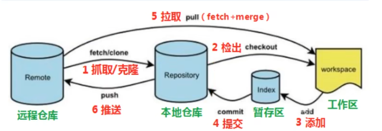

# 基于vscode的远程配置仓库开发指南

## 1. git简介
 1. git的定义：git是一个分布式版本控制系统，可以高效管理多人项目

 2. git的工作流程图：



## 2. git配置
1. 设置用户名：  
    > git config --global user.name "用户名"
    
2. 设置邮箱： 
    > git config --global user.email "邮箱"
    
3. 初始化:
    > git init

## 3. git的基本命令
1. 获取当前状态
    > git status

提示：会给出当前所在分支、未提交至本地仓库、当前工作区的文件等信息。

2. 添加到缓存区
    - 将单个文件暂存
    > git add 文件
    - 所有更改过的文件暂存
    > git add -u/.

3. 删除
- 删除本地文件
    > [git] rm [-r] 文件名

注：添加git后，git会检测到更改。
  
- 删除远程文件
  ```
   git rm --cached [-r] 文件名
  ```
提示：cache表示删除git的跟踪记录，不影响本地文件

4. 提交更改
    > git commit [文件] [-m "更新信息"]

注：git提交时，期望有提交信息，若无-m，则会打开编辑器，也要输入提交信息。当仅git commit时，会提交所有更改


5. 查看commit提交版本
    > git log

6. 创建 .ignore 文件和使用.ignore
    > touch .ignore 
    > mv 可忽略文件 .ignore

注：可将工作区可忽略的文件不提交至本地、远程仓库。

7. 查看本地仓库与远程仓库联系
    > git remote -v

注:其中 远程仓库名字默认为Oringin，可用远程仓库来代替URL

## 4. git 的分支

### 分支的基本概念：当修改仓库文件时，不确定修改的正确性，可以创建一个当前仓库的分支(包含当前仓库所有文件)，可在分支中修改、提交，在两个分支合并前，其都是相互独立的。

1. 创建分支
    > git branch 分支名

- 切换分支
    > git checkout [-b] 分支名

注：-b 表示创建并切换至新分支。

- 设置上游： 本地分支跟踪远程仓库，git pull，git push，git fetch无需指定分支
    > git push -u origin <new-branch>

注：pull、fetch区别为fetch仅下载，pull下载且自动合并。

3. 删除分支
-   本地删除
    > git branch -d\D 分支名

注：-d为合并后才能删除，-D为强制删除，且不允许删除当前分支。

-   远程删除
    > git push <remote-name> --delete <branch-name>

注：remote-name默认为origin

-   删除恢复
    > git reflog
    > git branch <branch-name> <commit-hash>

4. 将分支合并到当前分支
    > git merge 分支名

5. 拉取分支
- 本地已有
  > git fetch origin
  > git switch <branch-name>
- 本地没有
  > git fetch origin
  > git switch -c <branch-name> <remote-branch>

注：switch -c 表示创建并切换分支。

